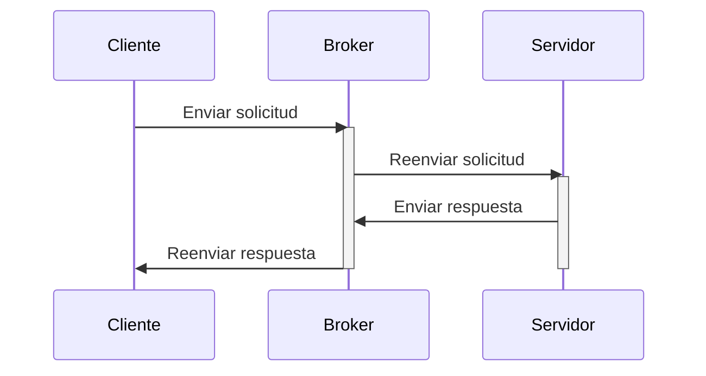

### Descripción
El patrón Broker, también conocido como "intermediario de mensajes", es un patrón de arquitectura de software que facilita la comunicación entre componentes desacoplados en un sistema distribuido. Actúa como un intermediario centralizado que maneja la interacción entre clientes y servidores, desacoplando a los participantes y promoviendo la flexibilidad y escalabilidad del sistema.

En un sistema Broker, los clientes no interactúan directamente con los servidores, sino que envían sus solicitudes al broker. El broker, a su vez, se encarga de:

- **Enrutar las solicitudes:** El broker utiliza mecanismos como filtros, colas de mensajes o algoritmos de balanceo de carga para determinar el servidor más adecuado para atender cada solicitud.
- **Transformar los mensajes:** El broker puede traducir formatos de datos, adaptar protocolos o agregar información adicional a los mensajes antes de entregarlos al servidor correspondiente.
- **Manejar las respuestas:** El broker recibe las respuestas de los servidores y las reenvía a los clientes correspondientes. También puede procesar las respuestas para agregar información o realizar acciones adicionales.

### ¿Cuándo se usa?
El patrón Broker es útil en diversas situaciones, como:

- **Sistemas distribuidos con componentes heterogéneos:** Cuando los componentes del sistema utilizan diferentes lenguajes de programación, protocolos de comunicación o plataformas, el broker facilita la comunicación entre ellos al abstraer las diferencias técnicas.
- **Sistemas con alta escalabilidad:** En sistemas que necesitan manejar un gran volumen de tráfico, el broker puede distribuir las solicitudes entre múltiples servidores de manera eficiente, mejorando el rendimiento y la disponibilidad del sistema.
- **Sistemas con requisitos de seguridad:** El broker puede implementar mecanismos de seguridad centralizados, como autenticación, autorización y control de acceso, para proteger los componentes del sistema y los datos que se intercambian.

### Ejemplos de Representación
- **Ejemplo 1**: En este ejemplo, los clientes A y B envían solicitudes al broker B, que las enruta a los servidores correspondientes C y D. Los servidores envían las respuestas al broker, que las reenvía a los clientes.
	```mermaid
	graph TD
	A[Cliente 1] --> |Solicitud| B[Broker]
	B --> |Enrutamiento| C[Servidor 1]
	C --> |Respuesta| B
	B --> |Respuesta| A
	A[Cliente 2] --> |Solicitud| B
	B --> |Enrutamiento| D[Servidor 2]
	D --> |Respuesta| B
	B --> |Respuesta| A
	
	```

- **Ejemplo 2**: En este diagrama de secuencia, se muestra la interacción entre un cliente, un broker y un servidor utilizando el patrón Broker. El cliente envía una solicitud al broker, que la reenvía al servidor correspondiente. El servidor procesa la solicitud y envía la respuesta al broker, que la reenvía al cliente.

### Ventajas
- **Desacople:** Los componentes del sistema no necesitan conocerse entre sí para comunicarse, lo que facilita el mantenimiento y la evolución del sistema.
- **Escalabilidad:** El sistema puede escalarse horizontalmente agregando más servidores al broker, sin necesidad de modificar los clientes o servidores existentes.
- **Flexibilidad:** El broker puede adaptarse a cambios en los requisitos del sistema, como la incorporación de nuevos componentes o servicios.
- **Seguridad:** El broker puede centralizar la gestión de la seguridad, simplificando la implementación y el mantenimiento de las políticas de seguridad.

### Desventajas
- **Complejidad:** La implementación de un broker puede aumentar la complejidad del sistema, especialmente en sistemas distribuidos grandes o con requisitos de rendimiento exigentes.
- **Dependencia del broker:** El sistema depende del correcto funcionamiento del broker, lo que puede ser un punto crítico de falla si el broker no está disponible o falla.
- **Overhead:** El procesamiento adicional realizado por el broker puede introducir cierta latencia en la comunicación entre clientes y servidores.

### Atributos Asociados
- Modificabilidad 
- Portabilidad
- Reusabilidad
- Escalabilidad
- Interoperabilidad

### Atributos en conflicto
- Desempeño