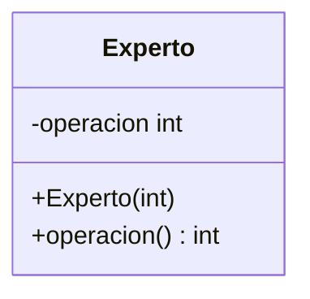

## Descripción
- Puede tener otros nombres como `Experto en Información` y `Experto`
- El patrón de diseño "Experto" (Expert) es un principio de diseño orientado a objetos que sugiere que la responsabilidad de realizar una operación relacionada con cierta información debe ser asignada a la clase que tiene la mayor cantidad de información necesaria para llevar a cabo esa operación.

#### Problema
¿Cuál es el principio fundamental en virtud del cual se asignan las responsabilidades en el enfoque orientado a objetos?
El problema que resuelve el patrón Experto es la asignación adecuada de responsabilidades en un sistema. En un sistema complejo, puede ser difícil determinar qué clase debe ser responsable de realizar una operación específica. El patrón Experto ayuda a asignar responsabilidades de manera que cada clase tenga solo las responsabilidades que están estrechamente relacionadas con su información, lo que facilita la gestión y el mantenimiento del sistema.

#### Solución
El objetivo principal del patrón Experto es asignar responsabilidades a las clases que tienen la información necesaria para cumplir con esas responsabilidades. Esto promueve la cohesión y reduce el acoplamiento, facilitando así el mantenimiento y la evolución del sistema.

#### Aplicaciones
El patrón Experto se utiliza en diversos sistemas de software, especialmente en aquellos que requieren una clara asignación de responsabilidades y una buena modularización. Ejemplos incluyen sistemas empresariales, aplicaciones de gestión, y cualquier sistema donde la información y las operaciones estén estrechamente relacionadas.

## Estructura

#### Representación


``
![[Pasted image 20240723124145.png]]
#### Participantes
- **Experto**: La clase que tiene la información necesaria para realizar una tarea específica.
#### Principios de Diseño asociados
1. **Single Responsibility Principle ([[Única Responsabilidad]])**: El patrón Experto promueve la separación de responsabilidades al asignar operaciones a la clase que tiene la mayor cantidad de información necesaria para llevar a cabo esa operación. Esto ayuda a cumplir con el principio de que una clase debe tener una sola razón para cambiar.
2. **[[Encapsular la variabilidad]]**: El patrón Experto encapsula la lógica relacionada con cierta información en la clase que tiene esa información, lo que ayuda a minimizar el impacto de los cambios en el sistema.
3. **[[Una y solo una regla]]**: El patrón Experto tiene una única responsabilidad: asignar responsabilidades a la clase que tiene la mayor cantidad de información necesaria para llevar a cabo esa operación.
4. **[[Modularidad, cohesión y acoplamiento]]**: El patrón Experto promueve la modularidad al asignar responsabilidades a la clase que tiene la mayor cantidad de información necesaria para llevar a cabo esa operación, lo que reduce el acoplamiento entre componentes.


#### Consecuencias
#### Ventajas
- **Cohesión alta**: Las clases tienen responsabilidades claras y bien definidas.
- **Acoplamiento bajo**: Reduce la dependencia entre clases.
- **Mantenimiento y evolución facilitados**: Cambios en una parte del sistema tienen menos impacto en otras partes.
#### Desventajas
- Puede llevar a la creación de muchas clases pequeñas, lo que puede complicar la estructura del sistema si no se gestiona adecuadamente.
#### Patrones Relacionados
- **Patrón de Diseño [[Singleton]]**: Para asegurar que una clase tenga una única instancia.
- **Patrón de Diseño [[Factory]]**: Para la creación de objetos.
- **Patrón de Diseño [[Observer]]**: Para notificar cambios a otros objetos.
#### Código de ejemplo
``` java
public class Experto{
	private int informacion;

	public Experto(int informacion){
		this.informacion = informacion;
	}

	public int operacion(){
		return informacion * 2;
	}
}
```